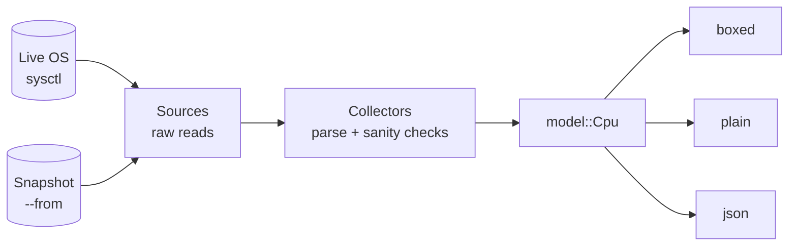

# cpu

[](https://github.com/priyansh-anand/cpu-cli/actions/workflows/ci.yml)
[](https://crates.io/crates/cpu-cli)

**See what silicon you're actually running.** A fast, readable CPU inspector for the terminal, in the spirit of `duf`, `bat` and `eza`, for the one classic tool that never got a modern rewrite: `lscpu`.

```
╭ Identity ────────────────────────────────────────────────────────╮
│ Name          Apple M5                                           │
│ Vendor        Apple                                              │
│ Architecture  arm64                                              │
╰──────────────────────────────────────────────────────────────────╯
╭ Topology ────────────────────────────────────────────────────────╮
│ Cores     10 physical · 10 logical · no SMT                      │
│ Clusters  4 × Super · 6 × Efficiency                             │
╰──────────────────────────────────────────────────────────────────╯
╭ Clocks ─┬──────────┬─────────────────────────────────────────────╮
│         │ Super    │ Efficiency                                  │
├─────────┼──────────┼─────────────────────────────────────────────┤
│ Max     │ 4.46 GHz │ 3.05 GHz                                    │
╰─────────┴──────────┴─────────────────────────────────────────────╯
╭ Cache ─┬──────────────────┬──────────────────────────────────────╮
│ Level  │ Super            │ Efficiency                           │
├────────┼──────────────────┼──────────────────────────────────────┤
│ L1i    │ 192 KiB / core   │ 128 KiB / core                       │
│ L1d    │ 128 KiB / core   │ 64 KiB / core                        │
│ L2     │ 16 MiB / 4 cores │ 6 MiB / 6 cores                      │
╰────────┴──────────────────┴──────────────────────────────────────╯
╭ Features ────────────────────────────────────────────────────────╮
│ SIMD      NEON · FP16 · BF16 · I8MM · DotProd · FHM · SME · SME2 │
│           SME2.1                                                 │
│ Crypto    AES · PMULL · SHA1 · SHA256 · SHA512 · SHA3 · CRC32    │
│ Security  PAC · BTI · MTE · DIT · SB · CSV2 · CSV3               │
│ Other     LSE · LSE2                                             │
╰──────────────────────────────────────────────────────────────────╯
```

> **Status: early development.** Supported today: macOS (Apple Silicon, including x86 builds under Rosetta 2, and Intel) and Linux (x86-64 and ARM64); see [Platform support](#platform-support).

## Why

- **`lscpu` is hard to read**, and it doesn't exist on macOS at all. On a Mac the same facts are scattered across dozens of `sysctl` keys.
- **Modern CPUs aren't uniform.** Performance and efficiency cores, shared caches and chiplets make a flat key/value dump actively misleading. `cpu` groups cores by type and shows which caches are shared by how many cores.
- **It never prints a guess.** Every value records where it came from. Anything the OS doesn't report is left out, not filled with `0` or a plausible-looking default.

## Install

**Homebrew** (macOS and Linux):

```sh
brew install priyansh-anand/tap/cpu-cli
```

**Prebuilt binary** (macOS on Apple Silicon or Intel; Linux on x86-64 or ARM64, statically linked, so it runs on any distribution):

```sh
curl --proto '=https' --tlsv1.2 -LsSf https://github.com/priyansh-anand/cpu-cli/releases/latest/download/cpu-cli-installer.sh | sh
```

Or download an archive from [Releases](https://github.com/priyansh-anand/cpu-cli/releases); each has a `.sha256` checksum.

**[crates.io](https://crates.io/crates/cpu-cli)** (Rust 1.85 or newer):

```sh
cargo install cpu-cli
```

**From source:**

```sh
git clone https://github.com/priyansh-anand/cpu-cli
cd cpu-cli
cargo install --locked --path .
```

Every method installs one binary, `cpu`. The package is named `cpu-cli` because `cpu` is taken on crates.io.

## Usage

```sh
cpu                      # boxed tables in a terminal
cpu --plain              # aligned ASCII text: no boxes, no colour
cpu --json               # machine-readable output (see below)
cpu --explain            # every value and where it came from
cpu --dump               # save this machine's raw CPU data for a bug report
cpu --from snapshot.tar.gz   # show a saved snapshot instead of this machine
```

| Option | Effect |
|---|---|
| `--json` | Print JSON (`schema_version` 1). Overrides every display option. |
| `--plain` | Print plain text: ASCII only, no box drawing, no escape codes. |
| `--explain` | List every value with its origin, then anything that was rejected. Plain text; can't be combined with `--json` or `--plain`. |
| `--color auto\|always\|never` | When to use colour. Default `auto`. |
| `--from <SNAPSHOT>` | Read a snapshot directory or `.tar.gz` instead of the live machine. |
| `--dump [FILE]` | Write a snapshot to `FILE` (default `./cpu-dump-<UTC time>.tar.gz`) and print its path. Never overwrites an existing file. |

### Output modes, pipes and colour

`cpu` picks the right output for where it's going:

- **In a terminal** it draws coloured boxes: core types, cache levels and feature groups each get a colour, numbers stand out, and units and borders are dimmed. Every colour repeats something the text already says, so nothing is lost without it.
- **In a pipe or file** (`cpu | grep L2`, `cpu > cpu.txt`) it switches to `--plain`, so the output greps and diffs cleanly.
- **In a non-UTF-8 locale** (`LANG=C`) it uses plain text, because box-drawing characters wouldn't render.
- `--color always` (or `CLICOLOR_FORCE=1`) keeps the boxes and colour even in a pipe, e.g. for `cpu --color always | less -R`.
- `NO_COLOR` disables colour but keeps the boxes, per [no-color.org](https://no-color.org).
- On a 256-colour terminal, `cpu` asks the terminal for its foreground and background colours and, on a light background, uses shades tuned for it. Terminals that don't support the question are detected at once; `cpu` waits up to a second for a reply, so slow SSH links still work, and never asks from a pipe or a background job (`cpu &`). Other terminals get the 16 standard colours, which follow your terminal's theme.
- `TERM=dumb` turns colour off, like `NO_COLOR`; `--color always` still forces it.
- Closing the pipe early (`cpu | head -1`) is not an error.

### JSON

`--json` is the stable, scriptable interface. Each value carries its origin, and unknown values are **omitted, never `null`**:

```json
{
  "schema_version": 1,
  "identity": {
    "vendor": { "value": "Apple", "origin": "derived" },
    "name":   { "value": "Apple M5", "origin": "detected", "from": "sysctl:machdep.cpu.brand_string" },
    "arch":   { "value": "arm64", "origin": "detected", "from": "sysctl:hw.optional.arm64" }
  },
  "topology": { "...": "..." },
  "clusters": [ "..." ],
  "features": { "groups": [ "..." ], "raw": [ "..." ] }
}
```

```sh
# Cores per core type
cpu --json | jq -c '.clusters[] | {name: .name.value, cores: .cores.value}'
# {"name":"Super","cores":4}
# {"name":"Efficiency","cores":6}

# Is SME available?
cpu --json | jq '.features.raw | index("FEAT_SME") != null'
```

The full contract is [`schema/cpu.v1.json`](schema/cpu.v1.json); compatibility rules are in [docs/json-output.md](docs/json-output.md).

### Reporting a machine that looks wrong

```sh
cpu --dump
# ./cpu-dump-20260924-185512.tar.gz
```

Attach that file to a [machine snapshot issue](https://github.com/priyansh-anand/cpu-cli/issues/new?template=machine-snapshot.md). A snapshot contains **only CPU data**, captured from a fixed allowlist (on macOS, `sysctl` keys under `hw.*` and `machdep.cpu.*` and the power manager's frequency tables from IOKit; on Linux, `/proc/cpuinfo` without serial numbers, the kernel release and architecture, specific topology, cache and clock files under `/sys/devices/system/cpu` and `/sys/devices/system/node`, the hybrid core-type lists under `/sys/devices/cpu_*/cpus`, and the DMI system vendor and product name). It never includes your hostname, serial numbers or hardware UUIDs. Anyone can replay it exactly with `cpu --from`, and it becomes a permanent regression test. The format is documented in [docs/snapshot-format.md](docs/snapshot-format.md).

### Exit codes

| Code | Meaning |
|---|---|
| `0` | Output printed (some fields may be absent because the OS doesn't report them). |
| `1` | The CPU could not be identified, the snapshot could not be read, `--dump` could not write its file, or the OS is not supported yet. |
| `2` | Invalid command-line usage. |
| `101` | Internal error: a bug in `cpu`. The message asks for a `cpu --dump` to attach to an issue. |

## Where values come from

Every value has one of three origins, visible in `--json`:

| Origin | Meaning | Example |
|---|---|---|
| `detected` | Read from this machine; `from` names the exact key or file. | `sysctl:hw.perflevel0.l2cachesize` |
| `derived` | Computed from other detected values. | SMT = logical ÷ physical CPUs |
| `database` | Filled from a built-in table because the OS reports only an ID; `from` names the table and its date. Used for ARM core and vendor names on Linux. | `arm-midr@2026-09` |

If none of these can produce a value, the row is hidden. In the tables, a value from a built-in table ends with `†` (`*` in plain output), and a footnote names the table; `cpu --explain` lists the origin of every value.

## Platform support

| Platform | Status |
|---|---|
| macOS, Apple Silicon | ✅ Identity, per-core-type clusters, L1/L2 caches, max clock per core type (from IOKit; verified on M5 hardware so far), feature flags |
| Linux, x86-64 | ✅ Identity, Intel hybrid P/E cores, caches (including an L3 shared across core types), base/max clocks, NUMA nodes, hypervisor |
| Linux, ARM64 | ✅ Identity (core names from the ARM MIDR table), big.LITTLE clusters, caches, clocks, NUMA, hypervisor |
| macOS, Intel | 🧪 Identity, caches (sharing from `hw.cacheconfig`), base clock, feature flags. Tested only against a hand-written snapshot; a `cpu --dump` from a real Intel Mac is very welcome |
| Rosetta 2 | ✅ An x86 build on Apple Silicon reports the real chip and says it is translated |
| Windows, BSD | Not yet planned |

On a platform that isn't supported yet, `cpu` exits with status 1 and a message instead of printing incomplete data.

## How it works



Sources are the only code that touches the operating system, and every source has a *recorded* twin that reads a snapshot. So the whole program, including its test suite, runs identically on a live machine and on a snapshot captured from someone else's hardware. See [docs/architecture.md](docs/architecture.md).

## Development

```sh
cargo build
cargo test                                  # unit, CLI, schema, golden and invariant tests
cargo fmt --check
cargo clippy --all-targets -- -D warnings
cargo deny check                            # licence and advisory policy (deny.toml)
cargo build --release                       # then a live smoke test of that build:
scripts/smoke.sh target/release/cpu
```

See [CONTRIBUTING.md](CONTRIBUTING.md) for the test layout, how to add a machine fixture, and how to review output snapshots.

## Roadmap

1. **Next**: more real-hardware fixtures, especially Apple Silicon Pro/Max chips and Intel Macs; please send a `cpu --dump`.
2. **Later**: Windows, theming, fleet auditing (`--check`).

Out of scope: live monitoring (use `btop`), benchmarking and overclocking.

## License

[GPL-3.0-or-later](LICENSE).
