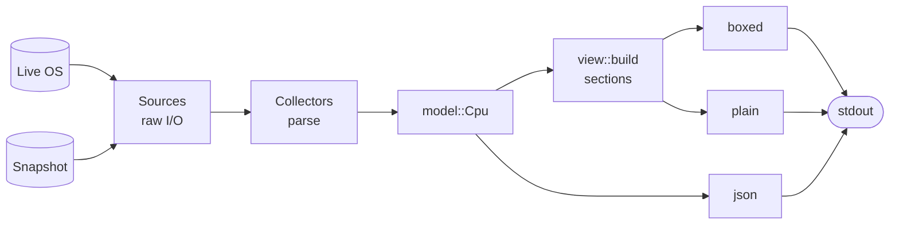
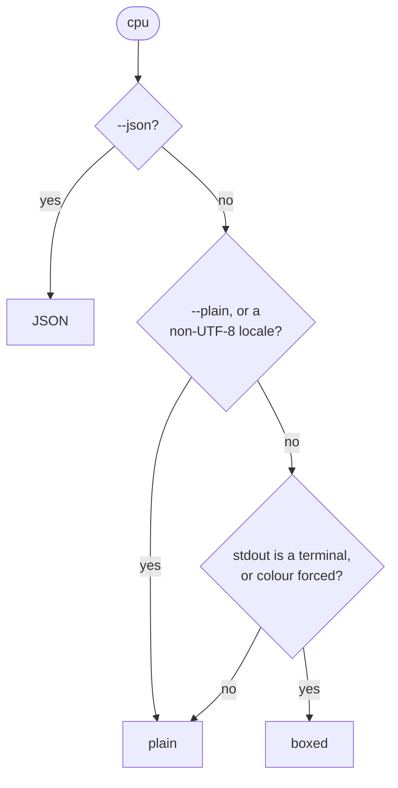

# Architecture

`cpu` is a pipeline of three layers with one shared data model in the middle.



The design goal is correctness across hardware the maintainers don't own. Every choice below serves one of two rules:

1. **Never print wrong data.** An unknown value is hidden, not guessed.
2. **Any machine can be replayed anywhere.** A snapshot from someone else's hardware runs through exactly the same code as the live machine.

## Sources (`src/source/`)

Sources are the only code that touches the operating system. Each is a narrow trait:

| Trait | Reads | Live implementation | Used by |
|---|---|---|---|
| `Sysctl` | `sysctl` keys | `macos::LiveSysctl` | macOS collector |
| `Fs` | files and directory listings | `files::LiveFs` (Linux) | Linux collector |
| `Cpuid` | CPUID leaves | none yet (planned, for Intel Macs) | x86 decoding |
| `IoReg` | IOKit registry properties | none yet (planned) | Apple Silicon clocks |

`Sources` bundles one of each plus the `Os` the data came from. `Sources::live()` builds this machine's sources; sources that don't exist on this OS are `Stub`s that return nothing, so collectors contain no `#[cfg]` logic. `Sources::recorded(path)` builds the same struct from a snapshot, backed by plain `BTreeMap`s.

**Live sysctl on macOS.** `sysctlbyname` returns untyped bytes. `LiveSysctl` first asks the kernel for each key's format with the `{0, 4}` "oidfmt" query (what `/usr/sbin/sysctl` itself does), then decodes: `A` strings, `I`/`IU` 32-bit and `Q`/`L` 64-bit integers, and packed arrays as space-separated strings. Key enumeration (needed for feature flags) uses `sysctl -N`.

## Collectors (`src/collect/`)

A collector turns raw source data into a `model::Cpu`. `collect::collect(&Sources)` dispatches on `Sources::os`. Collectors are compiled on every OS, so the macOS collector is tested on Linux CI against fixtures.

Every read goes through a small `Reader` that applies **sanity gates**: counts must be positive, and cache sizes must be a whole number of KiB and at most 1 GiB. A value that exists but fails a gate becomes `None` plus a `Diagnostic`, so it can never be printed. A missing key is normal (older OS, different chip) and is not a diagnostic.

### Apple Silicon specifics

- Each `hw.perflevelN` is one core type, fastest first. Each becomes one `Cluster`, named with the OS's own label (`hw.perflevelN.name`: an M5 calls its fast cores "Super", not "Performance").
- The top-level `hw.l1icachesize`/`hw.l1dcachesize`/`hw.l2cachesize` keys describe **only the efficiency cores** (6 MiB of L2 on an M5, whose Super cores have 16 MiB). The collector never uses them. Without `hw.perflevel*` keys (macOS 11) the Cache section is hidden rather than guessed.
- There is no vendor key; "Apple" is derived from a brand string starting with `Apple `.

### Linux specifics

- Online CPUs come from `/sys/devices/system/cpu/online`; a core is a distinct `thread_siblings_list`, and a socket a distinct `physical_package_id`.
- Core types: Intel hybrid lists P- and E-cores under `/sys/devices/cpu_core/cpus` and `/sys/devices/cpu_atom/cpus`. On ARM, CPUs are grouped by `cpu_capacity` and the `CPU part` from `/proc/cpuinfo`, fastest first, and named from the MIDR table.
- Caches come from `cpuN/cache/indexM`. An instance whose `shared_cpu_list` spans more than one core type (an Intel hybrid L3) is a shared cache; offline CPUs never count as sharers.
- Clocks are `base_frequency` and `cpuinfo_max_freq` (kHz). Current frequency is not collected: it changes every moment and would make a dump impossible to replay.
- Hypervisor: x86 trusts the `hypervisor` CPU flag; ARM matches known virtual-platform DMI names and skips bare-metal instances (`*.metal`). The name shown comes from a small table of platforms (KVM/QEMU, Hyper-V, VMware, Amazon EC2, Google Compute Engine, Apple Virtualization and others), because the raw DMI product name is often a machine type or an instance size.
- ARM names come from `data/arm-midr.toml`, generated from util-linux. Apple part `0x000` is left out: Apple's hypervisor reports it for every Linux guest, and lscpu would call it "Swift".

## Data model (`src/model.rs`)

```rust
pub struct Fact<T> { pub value: T, pub origin: Origin }
pub enum Origin { Detected(String), Derived, Database(&'static str) }
pub type F<T> = Option<Fact<T>>;
```

- Every value that can be unknown is an `F<T>`. `None` means unknown, and renderers hide it.
- `Origin::Detected` stores the exact key or path it was read from; `Derived` values are computed from detected ones; `Database` values come from a built-in table (none yet).

**Clusters are core-type groups, not physical clusters.** An M2 Pro has two physical performance clusters, each with its own L2; the model has one `Performance` cluster whose L2 is `16 MiB, shared_by 4, instances 2`. Physical sharing is expressed only through `Cache::shared_by` (logical CPUs per cache instance) and `Cache::instances`. This keeps renderers vendor-agnostic: a uniform desktop CPU is one cluster, a hybrid chip is two, and nothing in the rendering code special-cases either. Caches that span core types (an Intel hybrid L3, Apple's SLC) belong in `Cpu::shared_caches`.

## Renderers (`src/render/`)

Renderers are pure functions of the model.

- `view::build(&Cpu, &Glyphs)` turns the model into display-ready `Section`s: label/value pairs, or a grid with one column per cluster. Rows with unknown values and sections with no rows are dropped here, once.
- `boxed` draws those sections as duf-style boxes of equal width; `plain` prints them as aligned ASCII text. Both consume the same sections, so they can never disagree about *what* is shown, only about framing and glyphs (`·`/`×` vs `,`/`x`).
- `json` serialises the model directly (see [json-output.md](json-output.md)).

The box renderer is hand-written (about 100 lines) rather than using `comfy-table` or `tabled`, because section titles sit inside the top border and grid column separators join the frame. Owning every character also keeps the golden tests exact. Colour is applied after padding and outside the padding, so escape codes never affect the layout.

### Mode selection

`render::choose` decides the output from the flags and a `Terminal` description (TTY, locale, `NO_COLOR`, `CLICOLOR_FORCE`):



Colour is *forced* by `--color always`, or by `CLICOLOR_FORCE` when `NO_COLOR` is unset. Boxed output is coloured unless `NO_COLOR` is set or `--color never` is given.

Plain output is ASCII-only, so it is safe in logs, pipes and any locale. A closed pipe while writing is treated as success.

## Snapshots and `--dump`

A snapshot is a directory or `.tar.gz` holding the raw inputs a collector reads; see [snapshot-format.md](snapshot-format.md). `--dump` captures a **fixed allowlist**, not "whatever today's collector reads", which gives two guarantees:

- Old snapshots keep working as collectors learn to read more keys.
- Nothing outside the allowlist (hostname, serial numbers, UUIDs) can ever be captured.

Because the recorded and live sources implement the same traits, `cpu --json --from $(cpu --dump)` is byte-identical to `cpu --json` (a test checks this on macOS).

## Built-in tables (`data/`, `build.rs`, `src/db.rs`)

TOML tables in `data/` are compiled into static Rust arrays by `build.rs`. The build rejects duplicates, unknown groups and missing fields, so bad data fails the build instead of shipping. There are two tables. `features.toml` controls how feature flags are grouped and named; it is presentation only and produces no `Fact`s. `arm-midr.toml` names ARM vendors and cores from MIDR codes on Linux; it is generated from util-linux by `scripts/gen-arm-midr.py` and its values carry `origin: database` with the stamp `arm-midr@2026-09`.

Tables fill only values the OS doesn't report (it reports the ID, not the name), match by exact key only, and carry a citation and a date stamp that appears in `origin.from`. An Apple chip table for clock speeds is planned.

## Testing strategy

| Layer | Guards |
|---|---|
| Unit tests | parsing, sysctl decoding, sanity gates, layout, mode selection |
| Fixtures (`tests/fixtures/`) | real and synthetic machines, replayed through the real pipeline |
| Golden outputs (`insta`) | exact boxed, plain and JSON output per fixture |
| Invariants | rules for *any* machine: cluster cores sum to physical cores; `shared_by × instances` equals the cluster's CPUs; boxed lines have equal width; plain output is ASCII; nothing renders as `None` or `0 B` |
| Schema | every fixture's JSON validates against `schema/cpu.v1.json` |
| CLI | exit codes, pipes, colour flags, dump/replay round trip |

Invariants are what make contributor snapshots safe to accept: they need no expected output, so a snapshot nobody has reviewed line by line is still checked.

## Design decisions

| Decision | Why | Trade-off |
|---|---|---|
| No `sysinfo` crate | It only reads the live system, so it can't be replayed from snapshots, and it exposes little cache or core-type data. | More direct OS code to maintain. |
| Library is internal | The stable promise to users is the JSON schema, not a Rust API. | No reuse as a crate until a later version. |
| Hide unknowns, record origins | Output you can trust is the product. | Some sections are absent on some machines. |
| Hand-written box renderer | Titles in borders and joined grid frames; exact golden output. | ~100 lines we own. |
| ASCII-only plain mode | Safe in any locale, log or pipe. | Less pretty when piped (use `--color always`). |
| GPL-3.0-or-later | Allows reusing util-linux data (GPL-2.0-or-later). | Not embeddable in proprietary software. |
