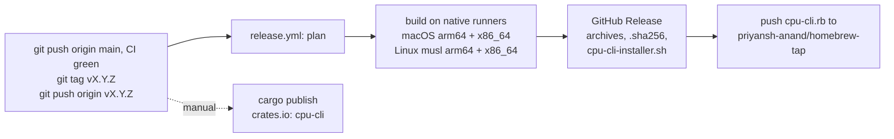

# Releasing

`cpu` is released from a version tag. [`dist`](https://axodotdev.github.io/cargo-dist/) builds the archives, installer and Homebrew formula in GitHub Actions; publishing to crates.io is a manual step, because a crates.io version can never be deleted.



## One-time setup

1. Point this checkout at the repository, push `main` and make it the default branch. (If `github.com/priyansh-anand/cpu-cli` does not exist, create it first with `gh repo create priyansh-anand/cpu-cli --public`.)

   ```sh
   git remote add origin https://github.com/priyansh-anand/cpu-cli.git
   git push -u origin main
   gh repo edit priyansh-anand/cpu-cli --default-branch main --description "See what silicon you're actually running: a modern lscpu for macOS and Linux"
   gh label create machine-snapshot --repo priyansh-anand/cpu-cli --color 0e8a16 --description "A cpu --dump from a machine"
   ```

   The label is the one the issue template applies; GitHub silently drops labels that don't exist.

2. Create the tap that `dist` pushes formulas to:

   ```sh
   gh repo create priyansh-anand/homebrew-tap --public --add-readme --description "Homebrew formulae"
   ```

3. Create a fine-grained personal access token with access to **only** `priyansh-anand/homebrew-tap` and the permission **Contents: Read and write**, then store it:

   ```sh
   gh secret set HOMEBREW_TAP_TOKEN --repo priyansh-anand/cpu-cli
   ```

4. Log in to crates.io once: `cargo login`.

The first CI run on `main` uploads a `snapshot-<runner>` artifact per runner. The `macos-26-intel` one is a real Intel Mac: `gh run download --name snapshot-macos-26-intel` saves `cpu-dump.tar.gz`; add it as a fixture as described in [CONTRIBUTING.md](../CONTRIBUTING.md#add-a-machine-fixture), unpacking that file in place of `cpu-dump-*.tar.gz`.

## Cutting a release

1. On an up-to-date `main` with no uncommitted files:
   - set `version` in `Cargo.toml` and run `cargo check`, so `Cargo.lock` follows;
   - rename `## [Unreleased]` in `CHANGELOG.md` to `## [X.Y.Z] - YYYY-MM-DD` (dist uses that section as the release notes);
   - for the first release only, delete the "not tagged yet" sentence from the README's Status line and update the Roadmap. The README ships inside every archive and on the crates.io page, which can never be edited for that version.

   Commit as `chore: release vX.Y.Z`.
2. Check locally: `dist plan` lists the four archives, `cpu-cli-installer.sh` and `cpu-cli.rb`, and `grep -n "not tagged yet" README.md` prints nothing.
3. Push the commit with `git push origin main`, and wait for CI to pass on it.
4. Tag it: `git tag vX.Y.Z && git push origin vX.Y.Z`. The `Release` workflow builds, creates the GitHub Release and updates the tap.
5. Publish the crate from the tagged commit: `cargo publish --locked`. CI's `cargo publish --dry-run` catches packaging problems, but this step can still fail if the working tree has uncommitted files (a Finder `.DS_Store` counts), if your crates.io account has no verified email (required before a first publish), or if someone has taken the name.
6. Verify: `brew install priyansh-anand/tap/cpu-cli && cpu`, and the installer on a Linux machine.

## Changing the release pipeline

`.github/workflows/release.yml` is generated. Edit `dist-workspace.toml`, then run `dist generate`. A pull request whose `release.yml` does not match the config fails `dist`'s `plan` job.
