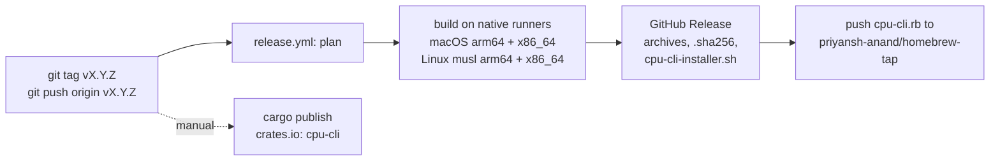

# Releasing

`cpu` is released from a version tag. [`dist`](https://opensource.axo.dev/cargo-dist/) builds the archives, installer and Homebrew formula in GitHub Actions; publishing to crates.io is a manual step, because a crates.io version can never be deleted.



## One-time setup

1. Create the repository and push `main`:

   ```sh
   gh repo create priyansh-anand/cpu-cli --public --source . --description "See what silicon you're actually running: a modern lscpu for macOS and Linux"
   git push -u origin main
   ```

2. Create the tap that `dist` pushes formulas to:

   ```sh
   gh repo create priyansh-anand/homebrew-tap --public --add-readme --description "Homebrew formulae"
   ```

3. Create a fine-grained personal access token with access to **only** `priyansh-anand/homebrew-tap` and the permission **Contents: Read and write**, then store it:

   ```sh
   gh secret set HOMEBREW_TAP_TOKEN --repo priyansh-anand/cpu-cli
   ```

4. Log in to crates.io once: `cargo login`.

The first CI run on `main` uploads a `snapshot-<runner>` artifact per runner. The `macos-26-intel` one is a real Intel Mac: `gh run download --name snapshot-macos-26-intel`, then add it as a fixture ([CONTRIBUTING.md](../CONTRIBUTING.md#add-a-machine-fixture)).

## Cutting a release

1. Make sure CI is green on `main`.
2. Set `version` in `Cargo.toml`, run `cargo check` so `Cargo.lock` follows, and rename `## [Unreleased]` in `CHANGELOG.md` to `## [X.Y.Z] - YYYY-MM-DD` (dist uses that section as the release notes). Commit as `chore: release vX.Y.Z`.
3. Check the plan locally: `dist plan` must list the four archives, `cpu-cli-installer.sh` and `cpu-cli.rb`.
4. Tag and push: `git tag vX.Y.Z && git push origin main vX.Y.Z`. The `Release` workflow builds, creates the GitHub Release and updates the tap.
5. Publish the crate from the tagged commit: `cargo publish --locked`. CI runs `cargo publish --dry-run` on every change, so this step only fails for account or network reasons.
6. Verify: `brew install priyansh-anand/tap/cpu-cli && cpu`, and the installer on a Linux machine.

## Changing the release pipeline

`.github/workflows/release.yml` is generated. Edit `dist-workspace.toml`, then run `dist generate`. A pull request whose `release.yml` does not match the config fails `dist`'s `plan` job.
